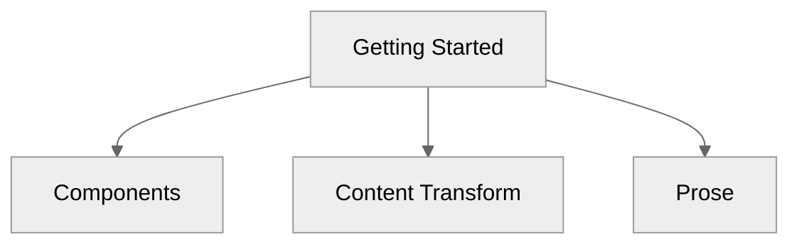

# Components

> Discover the components you can use in your markdown files.

## Alerts

<!-- prettier-ignore-start -->
::tabs
  ::div
  ---
  label: Preview
  icon: i-lucide-search
  ---
  ::note
  Highlights information that users should take into account, even when skimming.
  ::
  ::tip
  Optional information to help a user be more successful.
  ::
  ::important
  Crucial information necessary for users to succeed.
  ::
  ::warning{to="/"}
  Critical content demanding immediate user attention due to potential risks.
  ::
  ::caution{to="/"}
  Negative potential consequences of an action.
  ::
  ::
  ::div
  ---
  label: Code
  icon: i-lucide-square-code
  ---
  ```mdc
  ::note
  Highlights information that users should take into account, even when skimming.
  ::
  ::tip
  Optional information to help a user be more successful.
  ::
  ::important
  Crucial information necessary for users to succeed.
  ::
  ::warning{to="/"}
  Critical content demanding immediate user attention due to potential risks.
  ::
  ::caution{to="/"}
  Negative potential consequences of an action.
  ::
  ```
  ::
::
<!-- prettier-ignore-end -->

## Package Manager

Components to generate cross package manager comments

<!-- prettier-ignore-start -->
::tabs
  ::div
  ---
  label: Preview
  icon: i-lucide-search
  ---
  :pm-install{name="defu"}

  :pm-run{script="dev"}

  :pm-x{command="giget unjs new-lib"}

  ::
  ::div
  ---
  label: Code
  icon: i-lucide-square-code
  ---
  ```mdc
  :pm-install{name="defu"}

  :pm-run{script="dev"}

  :pm-x{command="giget unjs new-lib"}
  ```
  ::
::
<!-- prettier-ignore-end -->

## Read More

The component is used to create a link to another page.

<!-- prettier-ignore-start -->
::tabs
  ::div
  ---
  label: Preview
  icon: i-lucide-search
  ---
  :read-more{to="/guide"}
  :read-more{to="https://unjs.io" title="UnJS Website"}
  ::
  ::div
  ---
  label: Code
  icon: i-lucide-square-code
  ---
  ```mdc
  :read-more{to="/guide"}
  :read-more{to="https://unjs.io" title="UnJS Website"}
  ```
  ::
::
<!-- prettier-ignore-end -->

## Cards

Group related links or highlights into cards. A `::card` can be standalone or wrapped in a `::card-group` grid. Add a `to` to make the whole card a link.

<!-- prettier-ignore-start -->
::tabs
  ::div
  ---
  label: Preview
  icon: i-lucide-search
  ---
  ::card-group{cols="2"}
    ::card
    ---
    title: Getting Started
    icon: i-lucide-rocket
    to: /guide
    ---
    Install undocs and scaffold your first docs site.
    ::
    ::card
    ---
    title: Components
    icon: i-lucide-puzzle
    to: /guide/components
    ---
    Alerts, tabs, cards and more, straight from markdown.
    ::
  ::
  ::
  ::div
  ---
  label: Code
  icon: i-lucide-square-code
  ---
  ```mdc
  ::card-group{cols="2"}
    ::card
    ---
    title: Getting Started
    icon: i-lucide-rocket
    to: /guide
    ---
    Install undocs and scaffold your first docs site.
    ::
    ::card
    ---
    title: Components
    icon: i-lucide-puzzle
    to: /guide/components
    ---
    Alerts, tabs, cards and more, straight from markdown.
    ::
  ::
  ```
  ::
::
<!-- prettier-ignore-end -->

## Tabs

Group alternative content into tabs. Each direct child becomes a tab — set its `label` (or `title`) and an optional `icon`. Children can be `::tab` blocks or `::div` blocks carrying those props.

::tabs
::tab{label="npm" icon="i-lucide-package"}
Content shown under the **npm** tab.
::
::tab{label="pnpm" icon="i-lucide-package"}
Content shown under the **pnpm** tab.
::
::

```mdc
::tabs
  ::tab{label="npm" icon="i-lucide-package"}
  Content shown under the **npm** tab.
  ::
  ::tab{label="pnpm" icon="i-lucide-package"}
  Content shown under the **pnpm** tab.
  ::
::
```

## Steps

Render a vertical, numbered steps list. Each heading inside `::steps` becomes a numbered step; the content beneath it belongs to that step. Numbering and the guide line are produced with CSS, so any headings work.

::steps

#### Install the package

:pm-install{name="undocs"}

#### Run the dev server

:pm-run{script="dev"}

#### Ship your docs 🚀

::

```mdc
::steps
#### Install the package

:pm-install{name="undocs"}

#### Run the dev server

:pm-run{script="dev"}

#### Ship your docs 🚀
::
```

> [!TIP]
> Steps are also generated automatically from standard numbered lists — see [Content Transform](/guide/content-transformation#steps).

## Code Group

Group multiple code blocks into a single tabbed switcher. Each block's filename (in `[brackets]`) becomes its tab label, with a language icon inferred automatically.

::code-group

```json [package.json]
{
  "scripts": {
    "dev": "undocs dev"
  }
}
```

```ts [server/api/hello.get.ts]
export default defineEventHandler(() => {
  return { hello: "world" };
});
```

::

````mdc
::code-group
```json [package.json]
{
  "scripts": {
    "dev": "undocs dev"
  }
}
```

```ts [server/api/hello.get.ts]
export default defineEventHandler(() => {
  return { hello: "world" };
});
```
::
````

> [!NOTE]
> Consecutive code blocks are grouped automatically — see [Content Transform](/guide/content-transformation#auto-code-groups). Use `::code-group` when you need to group blocks that are not adjacent.

## Code Tree

Display a set of files in a VS Code–style explorer: a folder/file tree on the left, the selected file's highlighted code on the right. Filenames containing `/` (e.g. `[server/routes/index.ts]`) nest into folders. Use `defaultValue` to pick the initially selected file and `expandAll` to expand every folder.

::code-tree{defaultValue="src/app.ts" expandAll}

```ts [package.json]
{
  "name": "my-app"
}
```

```ts [src/app.ts]
export const app = createApp();
```

```ts [src/routes/index.ts]
export default defineRoute(() => "Hello");
```

::

````mdc
::code-tree{defaultValue="src/app.ts" expandAll}
```ts [package.json]
{
  "name": "my-app"
}
```

```ts [src/app.ts]
export const app = createApp();
```

```ts [src/routes/index.ts]
export default defineRoute(() => "Hello");
```
::
````

## Mermaid Graphs

````
  ```mermaid
  graph TD
  A[Getting Started] --> B[Components]
  A --> C[Content Transform]
  A --> D[Prose]

      click A "/guide"
      click B "/guide/components"
      click C "/guide/content-transformation"
      click D "/guide/prose"
  ```
````



## Prose Components

Undocs ships its own set of Prose components (built on [Reka UI](https://reka-ui.com/)) that render standard markdown — headings, links, tables, code blocks, and more — with sensible typography defaults. Just write markdown and they are applied automatically.

:read-more{to="/guide/prose" title="Prose rendering"}
