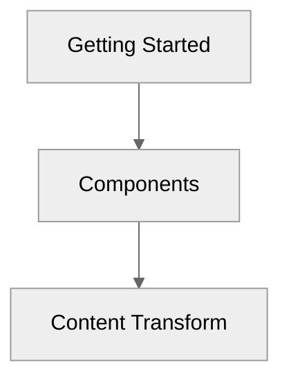

# Components

> Discover the components you can use in your markdown files.

<!-- automd:file src="../../.partials/warn.md" -->

> [!IMPORTANT]
> Undocs is currently intended for UnJS docs only and is not fully customizable yet. <br>
> Contributions are more than welcome but please consider that this project is not ready yet to be used. <br>
> We don't guarantee stability yet and it is expected that it doesn't work time to time.

<!-- /automd -->

## Alerts

<!-- prettier-ignore-start -->
::tabs
  ::div
  ---
  label: Preview
  icon: i-heroicons-magnifying-glass-circle
  ---
  ::note
  Highlights information that users should take into account, even when skimming.
  ::
  ::tip
  Optional information to help a user be more successful.
  ::
  ::important
  Crucial information necessary for users to succeed.
  ::
  ::warning{to="/"}
  Critical content demanding immediate user attention due to potential risks.
  ::
  ::caution{to="/"}
  Negative potential consequences of an action.
  ::
  ::
  ::div
  ---
  label: Code
  icon: i-heroicons-code-bracket-square
  ---
  ```mdc
  ::note
  Highlights information that users should take into account, even when skimming.
  ::
  ::tip
  Optional information to help a user be more successful.
  ::
  ::important
  Crucial information necessary for users to succeed.
  ::
  ::warning{to="/"}
  Critical content demanding immediate user attention due to potential risks.
  ::
  ::caution{to="/"}
  Negative potential consequences of an action.
  ::
  ```
  ::
::
<!-- prettier-ignore-end -->

## Package Manager

Components to generate cross package manager comments

<!-- prettier-ignore-start -->
::tabs
  ::div
  ---
  label: Preview
  icon: i-heroicons-magnifying-glass-circle
  ---
  :pm-install{name="defu"}

  :pm-run{script="dev"}

  :pm-x{command="giget unjs new-lib"}

  ::
  ::div
  ---
  label: Code
  icon: i-heroicons-code-bracket-square
  ---
  ```mdc
  :pm-install{name="defu"}

  :pm-run{script="dev"}

  :pm-x{command="giget unjs new-lib"}
  ```
  ::
::
<!-- prettier-ignore-end -->

## Read More

The component is used to create a link to another page.

<!-- prettier-ignore-start -->
::tabs
  ::div
  ---
  label: Preview
  icon: i-heroicons-magnifying-glass-circle
  ---
  :read-more{to="/guide"}
  :read-more{to="https://unjs.io" title="UnJS Website"}
  ::
  ::div
  ---
  label: Code
  icon: i-heroicons-code-bracket-square
  ---
  ```mdc
  :read-more{to="/guide"}
  :read-more{to="https://unjs.io" title="UnJS Website"}
  ```
  ::
::
<!-- prettier-ignore-end -->

## Mermaid Graphs

````
  ```mermaid
  graph TD
  A[Getting Started] --> B[Components]
  B --> C[Content Transform]

      click A "/guide"
      click B "/guide/components/components"
      click C "/guide/components/content-transformation"
  ```
````



## Nuxt UI

You can use all the Prose components from Nuxt UI in your markdown files.

Read more on https://ui4.nuxt.com/docs/typography
