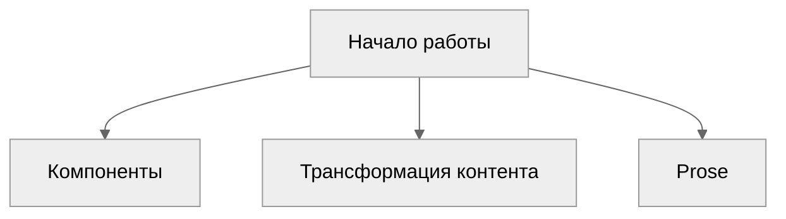

# Компоненты

> Компоненты, которые можно использовать в markdown-файлах.

## Alerts

<!-- prettier-ignore-start -->
::tabs
  ::div
  ---
  label: Preview
  icon: i-lucide-search
  ---
  ::note
  Важная информация, которую стоит учесть даже при беглом просмотре.
  ::
  ::tip
  Необязательная подсказка, которая помогает добиться лучшего результата.
  ::
  ::important
  Критически важные сведения, без которых пользователю не обойтись.
  ::
  ::warning{to="/"}
  Содержание, требующее немедленного внимания из‑за возможных рисков.
  ::
  ::caution{to="/"}
  Негативные последствия, к которым может привести действие.
  ::
  ::
  ::div
  ---
  label: Code
  icon: i-lucide-square-code
  ---
  ```mdc
  ::note
  Важная информация, которую стоит учесть даже при беглом просмотре.
  ::
  ::tip
  Необязательная подсказка, которая помогает добиться лучшего результата.
  ::
  ::important
  Критически важные сведения, без которых пользователю не обойтись.
  ::
  ::warning{to="/"}
  Содержание, требующее немедленного внимания из‑за возможных рисков.
  ::
  ::caution{to="/"}
  Негативные последствия, к которым может привести действие.
  ::
  ```
  ::
::
<!-- prettier-ignore-end -->

## Package Manager

Компоненты для генерации команд под разные пакетные менеджеры

<!-- prettier-ignore-start -->
::tabs
  ::div
  ---
  label: Preview
  icon: i-lucide-search
  ---
  :pm-install{name="defu"}

  :pm-run{script="dev"}

  :pm-x{command="giget unjs new-lib"}

  ::
  ::div
  ---
  label: Code
  icon: i-lucide-square-code
  ---
  ```mdc
  :pm-install{name="defu"}

  :pm-run{script="dev"}

  :pm-x{command="giget unjs new-lib"}
  ```
  ::
::
<!-- prettier-ignore-end -->

## Read More

Компонент создаёт ссылку на другую страницу.

<!-- prettier-ignore-start -->
::tabs
  ::div
  ---
  label: Preview
  icon: i-lucide-search
  ---
  :read-more{to="/ru/guide"}
  :read-more{to="https://unjs.io" title="Сайт UnJS"}
  ::
  ::div
  ---
  label: Code
  icon: i-lucide-square-code
  ---
  ```mdc
  :read-more{to="/ru/guide"}
  :read-more{to="https://unjs.io" title="Сайт UnJS"}
  ```
  ::
::
<!-- prettier-ignore-end -->

## Cards

Объединяйте связанные ссылки или акценты в карточки. `::card` может быть отдельно или внутри сетки `::card-group`. Добавьте `to`, чтобы вся карточка стала ссылкой.

<!-- prettier-ignore-start -->
::tabs
  ::div
  ---
  label: Preview
  icon: i-lucide-search
  ---
  ::card-group{cols="2"}
    ::card
    ---
    title: Начало работы
    icon: i-lucide-rocket
    to: /ru/guide
    ---
    Установите undocs и создайте свой первый сайт документации.
    ::
    ::card
    ---
    title: Компоненты
    icon: i-lucide-puzzle
    to: /ru/guide/components
    ---
    Alerts, вкладки, карточки и другое — прямо из markdown.
    ::
  ::
  ::
  ::div
  ---
  label: Code
  icon: i-lucide-square-code
  ---
  ```mdc
  ::card-group{cols="2"}
    ::card
    ---
    title: Начало работы
    icon: i-lucide-rocket
    to: /ru/guide
    ---
    Установите undocs и создайте свой первый сайт документации.
    ::
    ::card
    ---
    title: Компоненты
    icon: i-lucide-puzzle
    to: /ru/guide/components
    ---
    Alerts, вкладки, карточки и другое — прямо из markdown.
    ::
  ::
  ```
  ::
::
<!-- prettier-ignore-end -->

## Tabs

Группируйте альтернативный контент во вкладки. Каждый прямой потомок становится вкладкой — задайте ему `label` (или `title`) и при необходимости `icon`. Потомками могут быть блоки `::tab` или `::div` с этими props.

::tabs
::tab{label="npm" icon="i-lucide-package"}
Содержимое вкладки **npm**.
::
::tab{label="pnpm" icon="i-lucide-package"}
Содержимое вкладки **pnpm**.
::
::

```mdc
::tabs
  ::tab{label="npm" icon="i-lucide-package"}
  Содержимое вкладки **npm**.
  ::
  ::tab{label="pnpm" icon="i-lucide-package"}
  Содержимое вкладки **pnpm**.
  ::
::
```

## Steps

Рендерит вертикальный нумерованный список шагов. Каждый заголовок внутри `::steps` становится шагом; контент под ним относится к этому шагу. Нумерация и линия-гид генерируются через CSS, поэтому подойдут любые заголовки.

::steps

#### Установите пакет

:pm-install{name="undocs"}

#### Запустите dev-сервер

:pm-run{script="dev"}

#### Опубликуйте документацию 🚀

::

```mdc
::steps
#### Установите пакет

:pm-install{name="undocs"}

#### Запустите dev-сервер

:pm-run{script="dev"}

#### Опубликуйте документацию 🚀
::
```

> [!TIP]
> Шаги также генерируются автоматически из обычных нумерованных списков — см. [Трансформация контента](/ru/guide/content-transformation#steps).

## Code Group

Объедините несколько блоков кода в один переключатель с вкладками. Имя файла в `[скобках]` становится подписью вкладки; иконка языка подставляется автоматически.

::code-group

```json [package.json]
{
  "scripts": {
    "dev": "undocs dev"
  }
}
```

```ts [server/api/hello.get.ts]
export default defineEventHandler(() => {
  return { hello: "world" };
});
```

::

````mdc
::code-group
```json [package.json]
{
  "scripts": {
    "dev": "undocs dev"
  }
}
```

```ts [server/api/hello.get.ts]
export default defineEventHandler(() => {
  return { hello: "world" };
});
```
::
````

> [!NOTE]
> Идущие подряд блоки кода группируются автоматически — см. [Трансформация контента](/ru/guide/content-transformation#auto-code-groups). Используйте `::code-group`, когда нужно сгруппировать блоки, которые не соседствуют.

## Code Tree

Покажите набор файлов в проводнике в стиле VS Code: дерево папок и файлов слева, подсвеченный код выбранного файла справа. Имена с `/` (например `[server/routes/index.ts]`) вкладываются в папки. Параметр `defaultValue` задаёт изначально выбранный файл, `expandAll` — раскрывает все папки.

::code-tree{defaultValue="src/app.ts" expandAll}

```ts [package.json]
{
  "name": "my-app"
}
```

```ts [src/app.ts]
export const app = createApp();
```

```ts [src/routes/index.ts]
export default defineRoute(() => "Hello");
```

::

````mdc
::code-tree{defaultValue="src/app.ts" expandAll}
```ts [package.json]
{
  "name": "my-app"
}
```

```ts [src/app.ts]
export const app = createApp();
```

```ts [src/routes/index.ts]
export default defineRoute(() => "Hello");
```
::
````

## Mermaid Graphs

````
  ```mermaid
  graph TD
  A[Начало работы] --> B[Компоненты]
  A --> C[Трансформация контента]
  A --> D[Prose]

      click A "/ru/guide"
      click B "/ru/guide/components"
      click C "/ru/guide/content-transformation"
      click D "/ru/guide/prose"
  ```
````



## Prose Components

Undocs поставляет собственный набор Prose-компонентов для стандартного markdown — заголовки, ссылки, таблицы, блоки кода и другое — с разумными типографическими настройками по умолчанию. Достаточно писать markdown: они применяются автоматически.

:read-more{to="/ru/guide/prose" title="Рендеринг Prose"}
